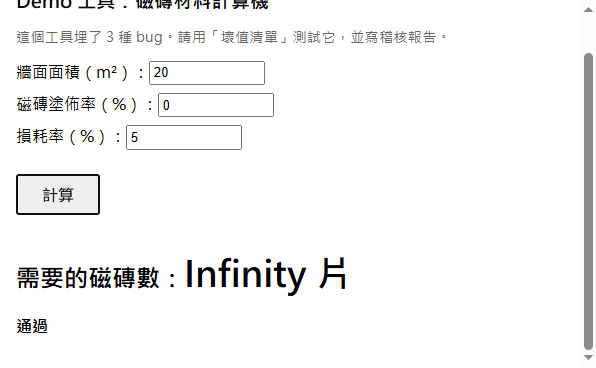
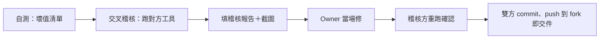

# 2026-10-03 邊界：agent 產出可以信幾分（第二堂，互相稽核）

- 主題：agent 產出的邊界＋稽核 SOP；不做大新工具，跑「自測→互相稽核→修 bug」閉環
- 對象：0919 完課，fork 裡至少一個工具（卡住但有開頭也算數）
- 節奏：10:00–12:00 講座 → 12:00–15:00 黑克松（互相稽核）→ 15:00–16:00 輪流簡報
- 本檔即簡報內容來源：每節對應投影片章節
- 課程資產：`demo/buggy-calculator.html`（埋雷示範工具）、`audit-report-template.md`（稽核報告模板）

## 課前準備

### 學生端

1. 同 0919：筆電＋電源，Git／Node／Antigravity＋OpenCode 就绪
2. 確認自己 fork 裡的 0919 工具還跑得到（至少一個能動的）；卡住的人先回報業師
3. 課前 15 分鐘先跑一次自己的工具，確認現在還能動

### 業師端

- [ ] `demo/buggy-calculator.html` 跑通，三種壞值都能重現（0→Infinity、waste<−100→負量、空白→NaN；−50 會得到正數＝假自信，可一併展示）
- [ ] `audit-report-template.md` 在主 repo，學生課堂自己 copy
- [ ] 座位配對：兩兩交換；人數奇數改三人圓圈（A 稽核 B、B 稽核 C、C 稽核 A）
- [ ] 備用機一台：稽核對象環境救不回時頂上

## 課程內容

### Part 1｜邊界：agent 產出可以信幾分（講座前半）

**開場：假通過示範**

- 先看上面這張截圖：塗佈率填 0，結果 Infinity 片、檢查卻報「通過」。
- 關鍵問題：「這張圖哪裡不對？」→ 檢查只擋了 NaN、沒擋 Infinity，所以整頁 Infinity 也報「通過」。
- 結論：檢查碼也是 agent 寫的，盲點跟程式碼重疊，「自己檢查自己」不叫驗證。
- 這堂要做的：從「要驗」升級到「照單子驗」，單子就是稽核 SOP，黑克松用它跑。

用班上案例開場——0919 計算引擎事件（PR #8）：

- 三種壞輸入照常顯示：
  - 塗佈率 = 0 → Infinity
  - 損耗率 < −100 → 負的用量（−50 反而正數 133 片＝假自信，比負數更危險）
  - 空白輸入 → NaN
- 渲染檢查只比對 NaN、不比對 Infinity → 整頁 Infinity 還報「通過」
- **結論：agent 的自我檢查不叫驗證**。檢查碼也是 agent 寫的，盲點跟程式碼盲點重疊
- 修法路徑：第三方稽核抓到 → 加 `驗證()` 擋所有壞值 → 11 組測試收尾

agent 易犯的錯（室內設計向）：

| 類型 | 例子 | 後果 |
|------|------|------|
| 邊界值 | 0、負數、空白、「全部」 | Infinity／NaN／負的用量；−50 會得到正數（假自信） |
| 單位混淆 | m vs cm、m² vs 坪 | 1 坪＝3.3058 m²，差 3 倍報價就錯 |
| 假自信 | 數字看起來合理但算錯 | 客戶照單全收 |
| 舊習慣 | 過期材料價、過期規範 | 估價失實 |

信任地圖（一張投影片）：

- 比較可信：文字結構、版面、重複性工作、風格一致
- 必須驗：數字、尺寸、數量、「這樣可以用」
- 回顧 AI 協作三原則（0919），這堂聚焦「agent 會錯」
- 升級：從「要驗」到「照單子驗」——單子就是 SOP，黑克松用它跑

### Part 2｜稽核 SOP＋示範（講座後半）

- 壞值清單：0／負數／空白／非數字／極大值；期望顯示 NaN／Infinity／undefined／「輸入有誤」
- 稽核報告＝壞值＋實際＋期望＋截圖（截圖就是證據，延續 0919 原則）
- 示範 10 分鐘：跑 `demo/buggy-calculator.html`
  1. 正常輸入 → 正常輸出
  2. 塗佈率＝0 → 結果 Infinity，檢查條卻顯示「通過」（假通過，笑點）
  3. 損耗率＝−150 → 負的用量；改填 −50 → 正數 133 片（假自信，數字合理但算錯）
  4. 空白 → NaN（唯一被擋到的，對照組）
  5. 當場把一條稽核報告寫完整（含截圖）
- 治理 10 分鐘角落：
  - 業主圖資：進 repo 先去識別化（業主名、地址、人名）
  - AI 產出的版權：圖與數都模糊 →「簽字的人負責」原則
- 配對規則講解（兩兩交換；奇數三人圓圈）

### Part 3｜黑克松：互相稽核（3hr）

「互相」只是稽核動作；產出仍是個人制，資料夾規則不變（只動自己 `學號_姓名/`）。

四段：

1. **自測（30min）**：用自己的工具照壞值清單跑，先抓自己的
2. **交叉稽核（90min）**：跑對方工具、照清單攻擊、每條發現一份報告（要截圖）；確認是 bug 就請對方當堂修
3. **修復＋回歸（45min）**：被稽核方修（大改前先 commit），稽核方重跑那個壞值確認
4. **收工（15min）**：雙方 commit＋push 到 fork＝交件

規則：

- 稽核方只寫自己資料夾；對方工具只跑不改
- 修復方：大改前先 commit；修完重跑稽核方的壞值確認
- 跑不動：也是稽核結果，記「跑不動＋原因」，找業師救環境
- bug 太多：全記錄、先修最嚴重 2 個，不追求全修

### Part 4｜簡報＋預告（1hr）

- 每人 2–3 分鐘：對方工具抓到什麼／自己被抓到什麼／最卡的地方
- 業師挑 1–2 個「全班共笑」或「全班共驚」的 bug 當場講（把 bug 變案例）
- 預告 1017：資料分析＋繼續磨小工具；無作業，push 到 fork 即交件

## 附錄：常見問題（課上隨查）

| 症狀 | 對策 |
|------|------|
| 對方工具跑不動 | 報告記「跑不動＋原因」，也是結果；環境找業師 |
| bug 多到修不完 | 全記錄、先修最嚴重 2 個 |
| 不會修 | 請 owner 叫 OpenCode（「修塗佈率 0 的 bug」），但 owner 必須自己驗 |
| 截圖要求 | 輸入＋結果同屏可見；存自己資料夾 `screenshots/` |
| 單位混淆（最常見） | 報告標明單位：m² 或坪、m 或 cm |
| 對方工具沒抓到 bug | 加更狠攻擊（極大值、非數字、空白）；還沒抓到→報告記「通過」，也值得講 |
